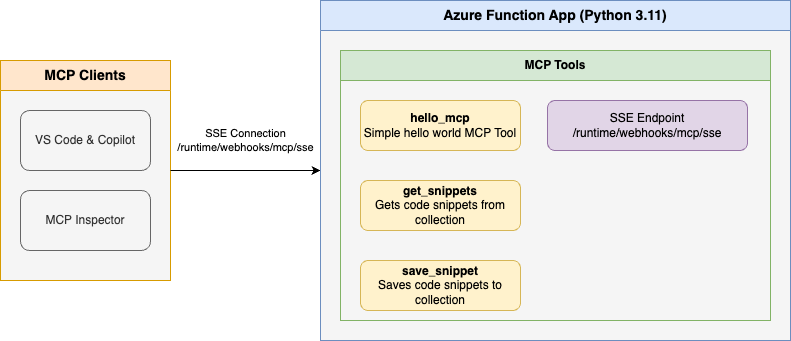

<!--
---
name: Remote MCP with Azure Functions (Python)
description: Run a remote MCP server on Azure functions.  
page_type: sample
languages:
- python
- bicep
- azdeveloper
products:
- azure-functions
- azure
urlFragment: remote-mcp-functions-python
---
-->

# Getting Started with Remote MCP Servers using Azure Functions (Python)

This is a quickstart template to easily build and deploy a custom remote MCP server to the cloud using Azure Functions with Python. You can clone/restore/run on your local machine with debugging, and `azd up` to have it in the cloud in a couple minutes. The MCP server is secured by design using keys and HTTPS, and allows more options for OAuth using built-in auth and/or [API Management](https://aka.ms/mcp-remote-apim-auth) as well as network isolation using VNET.

If you're looking for this sample in more languages check out the [.NET/C#](https://github.com/Azure-Samples/remote-mcp-functions-dotnet) and [Node.js/TypeScript](https://github.com/Azure-Samples/remote-mcp-functions-typescript) versions.

[](https://codespaces.new/Azure-Samples/remote-mcp-functions-python)

Below is the architecture diagram for the Remote MCP Server using Azure Functions:



## Prerequisites

+ [Python](https://www.python.org/downloads/) version 3.11 or higher
+ [Azure Functions Core Tools](https://learn.microsoft.com/azure/azure-functions/functions-run-local?pivots=programming-language-python#install-the-azure-functions-core-tools) >= `4.0.7030`
+ [Azure Developer CLI](https://aka.ms/azd)
+ To use Visual Studio Code to run and debug locally:
  + [Visual Studio Code](https://code.visualstudio.com/)
  + [Azure Functions extension](https://marketplace.visualstudio.com/items?itemName=ms-azuretools.vscode-azurefunctions)

## Prepare your local environment

An Azure Storage Emulator is needed for this particular sample because we will save and get snippets from blob storage.

1. Start Azurite

    ```shell
    docker run -p 10000:10000 -p 10001:10001 -p 10002:10002 \
        mcr.microsoft.com/azure-storage/azurite
    ```

>**Note** if you use Azurite coming from VS Code extension you need to run `Azurite: Start` now or you will see errors.

## Run your MCP Server locally from the terminal

1. Change to the src folder in a new terminal window:

   ```shell
   cd src
   ```

1. Install Python dependencies:

   ```shell
   pip install -r requirements.txt
   ```

>**Note** it is a best practice to create a Virtual Environment before doing the `pip install` to avoid dependency issues/collisions, or if you are running in CodeSpaces.  See [Python Environments in VS Code](https://code.visualstudio.com/docs/python/environments#_creating-environments) for more information.

1. Start the Functions host locally:

   ```shell
   func start
   ```

> **Note** by default this will use the webhooks route: `/runtime/webhooks/mcp`.  Later we will use this in Azure to set the key on client/host calls: `/runtime/webhooks/mcp?code=<system_key>`

## Connect to the *local* MCP server from a client/host

### VS Code - Copilot agent mode

1. **Add MCP Server** from command palette and add URL to your running Function app's MCP endpoint:

    ```shell
    http://0.0.0.0:7071/runtime/webhooks/mcp
    ```

1. **List MCP Servers** from command palette and start the server
1. In Copilot chat agent mode enter a prompt to trigger the tool, e.g., select some code and enter this prompt

    ```plaintext
    Say Hello
    ```

    ```plaintext
    Save this snippet as snippet1 
    ```

    ```plaintext
    Retrieve snippet1 and apply to newFile.py
    ```

1. When prompted to run the tool, consent by clicking **Continue**

1. When you're done, press Ctrl+C in the terminal window to stop the Functions host process.

### MCP Inspector

1. In a **new terminal window**, install and run MCP Inspector

    ```shell
    npx @modelcontextprotocol/inspector
    ```

2. CTRL click to load the MCP Inspector web app from the URL displayed by the app (e.g. http://0.0.0.0:5173/#resources)
3. Set the transport type to `Streamable HTTP`
4. Set the URL to your running Function app's MCP endpoint and **Connect**:

    ```shell
    http://0.0.0.0:7071/runtime/webhooks/mcp
    ```

>**Note** this step will not work in CodeSpaces.  Please move on to Deploy to Remote MCP.  

5. **List Tools**.  Click on a tool and **Run Tool**.

## Verify local blob storage in Azurite

After testing the snippet save functionality locally, you can verify that blobs are being stored correctly in your local Azurite storage emulator.

### Using Azure Storage Explorer

1. Open Azure Storage Explorer
1. In the left panel, expand **Emulator & Attached** → **Storage Accounts** → **(Emulator - Default Ports) (Key)**
1. Navigate to **Blob Containers** → **snippets**
1. You should see any saved snippets as blob files in this container
1. Double-click on any blob to view its contents and verify the snippet data was saved correctly

### Using Azure CLI (Alternative)

If you prefer using the command line, you can also verify blobs using Azure CLI with the storage emulator:

```shell
# List blobs in the snippets container
az storage blob list --container-name snippets --connection-string "DefaultEndpointsProtocol=http;AccountName=devstoreaccount1;AccountKey=Eby8vdM02xNOcqFlqUwJPLlmEtlCDXJ1OUzFT50uSRZ6IFsuFq2UVErCz4I6tq/K1SZFPTOtr/KBHBeksoGMGw==;BlobEndpoint=http://127.0.0.1:10000/devstoreaccount1;"
```

```shell
# Download a specific blob to view its contents
az storage blob download --container-name snippets --name <blob-name> --file <local-file-path> --connection-string "DefaultEndpointsProtocol=http;AccountName=devstoreaccount1;AccountKey=Eby8vdM02xNOcqFlqUwJPLlmEtlCDXJ1OUzFT50uSRZ6IFsuFq2UVErCz4I6tq/K1SZFPTOtr/KBHBeksoGMGw==;BlobEndpoint=http://127.0.0.1:10000/devstoreaccount1;"
```

This verification step ensures your MCP server is correctly interacting with the local storage emulator and that the blob storage functionality is working as expected before deploying to Azure.

## Deploy to Azure for Remote MCP

In the root directory, create a new [azd](https://aka.ms/azd) environment. This is going to become the resource group of your Azure resources: 

```shell
azd env new <reource-group-name>
```

Run this azd command to provision the function app, with any required Azure resources, and deploy your code:

```shell
azd up
```

You can opt-in to a VNet being used in the sample. To do so, do this before `azd up`

```bash
azd env set VNET_ENABLED true
```

Additionally, [API Management](https://aka.ms/mcp-remote-apim-auth) can be used for improved security and policies over your MCP Server, and [App Service built-in authentication](https://learn.microsoft.com/azure/app-service/overview-authentication-authorization) can be used to set up your favorite OAuth provider including Entra.  

## Connect to your *remote* MCP server function app from a client

Your client will need a key in order to invoke the new hosted MCP endpoint, which will be of the form `https://<funcappname>.azurewebsites.net/runtime/webhooks/mcp`. The hosted function requires a system key by default which can be obtained from the [portal](https://learn.microsoft.com/azure/azure-functions/function-keys-how-to?tabs=azure-portal) or the CLI (`az functionapp keys list --resource-group <resource_group> --name <function_app_name>`). Obtain the system key named `mcp_extension`.

### Connect to remote MCP server in MCP Inspector
For MCP Inspector, you can include the key in the URL: 
```plaintext
https://<funcappname>.azurewebsites.net/runtime/webhooks/mcp?code=<your-mcp-extension-system-key>
```

### Connect to remote MCP server in VS Code - GitHub Copilot
For GitHub Copilot within VS Code, you should instead set the key as the `x-functions-key` header in `mcp.json`, and you would just use `https://<funcappname>.azurewebsites.net/runtime/webhooks/mcp` for the URL. The following example uses an input and will prompt you to provide the key when you start the server from VS Code.  Note [mcp.json](.vscode/mcp.json) has already been included in this repo and will be picked up by VS Code.  Click Start on the server to be prompted for values including `functionapp-name` (in your /.azure/*/.env file) and `functions-mcp-extension-system-key` which can be obtained from CLI command above or API Keys in the portal for the Function App.  

```json
{
    "inputs": [
        {
            "type": "promptString",
            "id": "functions-mcp-extension-system-key",
            "description": "Azure Functions MCP Extension System Key",
            "password": true
        },
        {
            "type": "promptString",
            "id": "functionapp-name",
            "description": "Azure Functions App Name"
        }
    ],
    "servers": {
        "remote-mcp-function": {
            "type": "http",
            "url": "https://${input:functionapp-name}.azurewebsites.net/runtime/webhooks/mcp",
            "headers": {
                "x-functions-key": "${input:functions-mcp-extension-system-key}"
            }
        },
        "local-mcp-function": {
            "type": "http",
            "url": "http://0.0.0.0:7071/runtime/webhooks/mcp"
        }
    }
}
```

For MCP Inspector, you can include the key in the URL: `https://<funcappname>.azurewebsites.net/runtime/webhooks/mcp?code=<your-mcp-extension-system-key>`.

For GitHub Copilot within VS Code, you should instead set the key as the `x-functions-key` header in `mcp.json`, and you would just use `https://<funcappname>.azurewebsites.net/runtime/webhooks/mcp` for the URL. The following example uses an input and will prompt you to provide the key when you start the server from VS Code:

```json
{
    "inputs": [
        {
            "type": "promptString",
            "id": "functions-mcp-extension-system-key",
            "description": "Azure Functions MCP Extension System Key",
            "password": true
        }
    ],
    "servers": {
        "my-mcp-server": {
            "type": "http",
            "url": "<funcappname>.azurewebsites.net/runtime/webhooks/mcp",
            "headers": {
                "x-functions-key": "${input:functions-mcp-extension-system-key}"
            }
        }
    }
}
```

## Redeploy your code

You can run the `azd up` command as many times as you need to both provision your Azure resources and deploy code updates to your function app.

>[!NOTE]
>Deployed code files are always overwritten by the latest deployment package.

## Clean up resources

When you're done working with your function app and related resources, you can use this command to delete the function app and its related resources from Azure and avoid incurring any further costs:

```shell
azd down
```

## Helpful Azure Commands

Once your application is deployed, you can use these commands to manage and monitor your application:

```bash
# Get your function app name from the environment file
FUNCTION_APP_NAME=$(cat .azure/$(cat .azure/config.json | jq -r '.defaultEnvironment')/env.json | jq -r '.FUNCTION_APP_NAME')
echo $FUNCTION_APP_NAME

# Get resource group 
RESOURCE_GROUP=$(cat .azure/$(cat .azure/config.json | jq -r '.defaultEnvironment')/env.json | jq -r '.AZURE_RESOURCE_GROUP')
echo $RESOURCE_GROUP

# View function app logs
az webapp log tail --name $FUNCTION_APP_NAME --resource-group $RESOURCE_GROUP

# Redeploy the application without provisioning new resources
azd deploy
```

## Source Code

The function code for the `get_snippet` and `save_snippet` endpoints are defined in the Python files in the `src` directory. The MCP function decorators expose these functions as MCP Server tools.

This sample uses the new first-class MCP decorators available in `azure-functions>=1.25.0b2`, which dramatically simplify the code by:
- Inferring tool properties directly from function signatures and type hints
- Eliminating the need for manual JSON serialization of tool properties
- Using standard Python decorators (`@app.mcp_tool()`, `@app.mcp_tool_property()`, `@app.blob_input()`, `@app.blob_output()`)

**Important:** When using the MCP decorators, you must set `PYTHON_ISOLATE_WORKER_DEPENDENCIES=1` in your app settings (both locally in `local.settings.json` and in your deployed Azure Function App).

Here's the actual code from the function_app.py file:

```python
@app.mcp_tool()
def hello_mcp() -> str:
    """Hello world."""
    return "Hello I am MCPTool!"


@app.mcp_tool()
@app.mcp_tool_property(arg_name="snippetname", description="The name of the snippet.")
@app.blob_input(arg_name="file", connection="AzureWebJobsStorage", path=_BLOB_PATH)
def get_snippet(file: func.InputStream, snippetname: str) -> str:
    """Retrieve a snippet by name from Azure Blob Storage."""
    snippet_content = file.read().decode("utf-8")
    logging.info(f"Retrieved snippet: {snippet_content}")
    return snippet_content


@app.mcp_tool()
@app.mcp_tool_property(arg_name="snippetname", description="The name of the snippet.")
@app.mcp_tool_property(arg_name="snippet", description="The content of the snippet.")
@app.blob_output(arg_name="file", connection="AzureWebJobsStorage", path=_BLOB_PATH)
def save_snippet(file: func.Out[str], snippetname: str, snippet: str) -> str:
    """Save a snippet with a name to Azure Blob Storage."""
    if not snippetname:
        return "No snippet name provided"

    if not snippet:
        return "No snippet content provided"

    file.set(snippet)
    logging.info(f"Saved snippet: {snippet}")
    return f"Snippet '{snippet}' saved successfully"
```

Note that the `host.json` file also includes a reference to the _preview_ extension bundle, which is required for apps using this feature now:

```json
"extensionBundle": {
  "id": "Microsoft.Azure.Functions.ExtensionBundle.Preview",
  "version": "[4.32.0, 5.0.0)"
}
```

## Weather App Sample

A sample MCP App that displays weather information with an interactive UI.

### What Are MCP Apps?

[MCP Apps](https://blog.modelcontextprotocol.io/posts/2026-01-26-mcp-apps/) let tools return interactive interfaces instead of plain text. When a tool declares a UI resource, the host renders it in a sandboxed iframe where users can interact directly.

#### MCP Apps = Tool + UI Resource

The architecture relies on two MCP primitives:

1. **Tools** with UI metadata pointing to a resource URI
2. **Resources** containing bundled HTML/JavaScript served via the `ui://` scheme

Azure Functions makes it easy to build both.

### Prerequisites for Weather App

- [Python](https://www.python.org/downloads/) version 3.11 or higher
- [Node.js](https://nodejs.org/) (for building the UI)
- [Azure Functions Core Tools v4](https://learn.microsoft.com/azure/azure-functions/functions-run-local)
- An MCP-compatible host (Claude Desktop, VS Code, ChatGPT, etc.)

### Getting Started with Weather App

#### 1. Build the UI

The UI must be bundled before running the function app:

```bash
cd src/app
npm install
npm run build
cd ../
```

This creates a bundled `src/app/dist/index.html` file that the function serves.

#### 2. Run the Function App

In the `src` directory, run: 

```bash
func start
```

The MCP server will be available at `http://localhost:7071/runtime/webhooks/mcp`.

#### 3. Connect from VS Code

Open **.vscode/mcp.json**. Find the server called _local-mcp-function_ and click **Start** above the name. The server is already set up with the running Function app's MCP endpoint:

```shell
http://localhost:7071/runtime/webhooks/mcp
```

#### 4. Prompt the Agent

Ask Copilot: "What's the weather in Seattle?"

### Weather App Source Code

The source code is in [src/function_app.py](src/function_app.py). The key concept is how **tools connect to resources via metadata**.

#### The Tool with UI Metadata

The `get_weather` tool uses the `metadata` parameter in `@app.mcp_tool()` to declare it has an associated UI:

```python
# Required metadata
TOOL_METADATA = '{"ui": {"resourceUri": "ui://weather/index.html"}}'

@app.mcp_tool()
@app.mcp_tool_property(arg_name="location", description="City name to check weather for (e.g., Seattle, New York, Miami)")
def get_weather(location: str) -> Dict[str, Any]:
    """Returns current weather for a location via Open-Meteo."""
    logging.info(f"Getting weather for location: {location}")
    
    try:
        result = weather_service.get_current_weather(location)
        
        if "TemperatureC" in result:
            logging.info(f"Weather fetched for {result['Location']}: {result['TemperatureC']}°C")
        else:
            logging.warning(f"Weather error for {result['Location']}: {result.get('Error', 'Unknown error')}")
        
        return result
    except Exception as e:
        logging.error(f"Failed to get weather for {location}: {e}")
        return {
            "Location": location or "Unknown",
            "Error": f"Unable to fetch weather: {str(e)}",
            "Source": "api.open-meteo.com"
        }
```

The `resourceUri` points to `ui://weather/index.html`— this tells the MCP host that when this tool is invoked, there's an interactive UI available at that resource URI.

#### The Resource Serving the UI

The `get_weather_widget` function serves the bundled HTML at the matching URI:

```python
# Optional UI metadata
RESOURCE_METADATA = '{"ui": {"prefersBorder": true}}'

@app.mcp_resource_trigger(
    arg_name="context",
    uri=WEATHER_WIDGET_URI,
    resource_name=WEATHER_WIDGET_NAME,
    description=WEATHER_WIDGET_DESCRIPTION,
    mime_type=WEATHER_WIDGET_MIME_TYPE,
    metadata=RESOURCE_METADATA
)
def get_weather_widget(context) -> str:
    """Get the weather widget HTML content."""
    logging.info("Getting weather widget")
    
    try:
        # Get the path to the widget HTML file
        current_dir = Path(__file__).parent
        file_path = current_dir / "app" / "dist" / "index.html"
        
        if file_path.exists():
            return file_path.read_text(encoding="utf-8")
        else:
            # Return a fallback HTML if file not found
            return """<!DOCTYPE html>
<html>
<head><title>Weather Widget</title></head>
<body>
  <h1>Weather Widget</h1>
  <p>Widget content not found. Please ensure the app/dist/index.html file exists.</p>
</body>
</html>"""
    except Exception as e:
        logging.error(f"Error reading weather widget file: {e}")
        return """<!DOCTYPE html>
<html>
<head><title>Weather Widget Error</title></head>
<body>
  <h1>Weather Widget</h1>
  <p>Error loading widget content.</p>
</body>
</html>"""
```

#### How It Works Together

1. User asks: "What's the weather in Seattle?"
2. Agent calls the `get_weather` tool
3. Tool returns weather data (JSON) **and** the host sees the `ui.resourceUri` metadata
4. Host fetches the UI resource from `ui://weather/index.html`
5. Host renders the HTML in a sandboxed iframe, passing the tool result as context
6. User sees an interactive weather widget instead of plain text

#### The UI (TypeScript)

The frontend in `src/app/src/weather-app.ts` receives the tool result and renders the weather display. It's bundled with Vite into a single `index.html` that the resource serves.

## IoT Sensor Sample

A sample that demonstrates how to use MCP tools backed by Azure Blob Storage to **ingest, store, and analyse** structured IoT sensor data using a rich, multi-field payload (strings, arrays, nested objects).

### Overview

The IoT sample exposes four MCP tools, all persisting data in Azure Blob Storage (one blob per device):

| Tool | Blob binding | Description |
|---|---|---|
| `ingest_sensor_data` | output | Validate and save a full sensor payload |
| `get_sensor_report` | input | Full report with health score, alerts and maintenance info |
| `list_active_alerts` | input | Only unresolved alerts for a device |
| `get_sensor_metrics_summary` | input | Statistical summary (min/max/avg/stdev/trend) of readings |

The service layer lives in [`src/iot_service.py`](src/iot_service.py) and uses stdlib `dataclasses` only — no extra dependencies.

### Data Model

Each sensor device is stored as a single JSON blob under `iot-sensors/<device_id>.json`. The payload is intentionally rich to show how MCP tools handle strings, arrays, and nested objects:

```json
{
  "device_id": "sensor-industrial-001",
  "location": "Plant-A / Zone-3 / Line-2",
  "timestamp": "2026-03-19T10:30:00Z",
  "firmware_version": "2.4.1",
  "status": "operational",
  "tags": ["critical", "monitored", "area-b"],
  "metrics": {
    "temperature_celsius": 72.4,
    "humidity_percent": 45.2,
    "pressure_bar": 3.15,
    "vibration_hz": 120.8,
    "power_consumption_kw": 18.7
  },
  "alerts": [
    {
      "code": "TEMP_HIGH",
      "severity": "warning",
      "message": "Temperature above threshold",
      "triggered_at": "2026-03-19T10:28:00Z",
      "resolved": false
    }
  ],
  "maintenance": {
    "last_service_date": "2025-12-01",
    "next_service_date": "2026-06-01",
    "technician": "Mario Rossi",
    "notes": "Replaced filter unit B"
  },
  "network": {
    "ip_address": "192.168.10.45",
    "protocol": "MQTT",
    "signal_strength_dbm": -67,
    "connected_gateway": "gw-plant-a-01"
  },
  "history_last_5_readings": [71.2, 71.8, 72.0, 72.1, 72.4]
}
```

### IoT Source Code

The four MCP tools use `@app.mcp_tool_property()` with explicit `property_type` and `as_array` metadata so MCP clients can present a structured form instead of a free-text field.

#### `ingest_sensor_data` — save a sensor reading

```python
@app.mcp_tool()
@app.mcp_tool_property(
    arg_name="device_id",
    description="Unique identifier of the IoT device (e.g. sensor-industrial-001).",
    property_type=func.McpPropertyType.STRING
)
@app.mcp_tool_property(
    arg_name="location",
    description="Physical location of the device (e.g. Plant-A / Zone-3 / Line-2).",
    property_type=func.McpPropertyType.STRING
)
@app.mcp_tool_property(
    arg_name="timestamp",
    description="ISO 8601 timestamp of the reading (e.g. 2026-03-19T10:30:00Z).",
    property_type=func.McpPropertyType.DATETIME
)
@app.mcp_tool_property(
    arg_name="tags",
    description='Labels associated with the device (e.g. "critical", "area-b").',
    property_type=func.McpPropertyType.STRING,
    as_array=True
)
@app.mcp_tool_property(
    arg_name="metrics",
    description="Current physical measurements: temperature_celsius, humidity_percent, pressure_bar, vibration_hz, power_consumption_kw.",
    property_type=func.McpPropertyType.OBJECT
)
@app.mcp_tool_property(
    arg_name="alerts",
    description="Alert objects: code, severity (info|warning|critical), message, triggered_at, resolved.",
    property_type=func.McpPropertyType.OBJECT,
    as_array=True
)
@app.mcp_tool_property(
    arg_name="history_last_5_readings",
    description="Last temperature readings (up to 10 values), oldest first.",
    property_type=func.McpPropertyType.FLOAT,
    as_array=True
)
@app.blob_output(arg_name="file", connection="AzureWebJobsStorage", path=_IOT_BLOB_PATH)
def ingest_sensor_data(file: func.Out[str], device_id: str, ...) -> str:
    """Validate and save an IoT sensor payload to Azure Blob Storage."""
    ...
    sensor = iot_service.validate_payload(data)
    file.set(sensor.to_json())
    return f"Payload for device '{device_id}' saved successfully."
```

Key points:
- Scalar fields (`device_id`, `location`, `timestamp`, …) use `property_type=func.McpPropertyType.STRING` or `DATETIME`
- Array fields (`tags`, `alerts`, `history_last_5_readings`) use `as_array=True`
- Nested objects (`metrics`, `maintenance`, `network`) use `property_type=func.McpPropertyType.OBJECT`
- The blob path uses `{mcptoolargs.device_id}` so each device gets its own blob

#### `get_sensor_report` — full report with health score

```python
@app.mcp_tool()
@app.mcp_tool_property(
    arg_name="device_id",
    description="Unique identifier of the IoT device to generate the report for."
)
@app.blob_input(arg_name="file", connection="AzureWebJobsStorage", path=_IOT_BLOB_PATH)
def get_sensor_report(file: func.InputStream, device_id: str) -> str:
    """Read IoT sensor data from Azure Blob Storage and return a full report
    with health score, metrics, active alerts, and maintenance information."""
    data = json.loads(file.read().decode("utf-8"))
    sensor = iot_service.validate_payload(data)
    return json.dumps(iot_service.generate_report(sensor))
```

The report includes a `health_score` (0–100) decremented by device status and active alert severity, plus `days_to_next_service`.

#### `list_active_alerts` and `get_sensor_metrics_summary`

Both follow the same `blob_input` pattern with `device_id` as the only tool argument:

```python
@app.mcp_tool()
@app.mcp_tool_property(arg_name="device_id", description="...")
@app.blob_input(arg_name="file", connection="AzureWebJobsStorage", path=_IOT_BLOB_PATH)
def list_active_alerts(file: func.InputStream, device_id: str) -> str:
    """Return only alerts where resolved=false."""
    ...

@app.mcp_tool()
@app.mcp_tool_property(arg_name="device_id", description="...")
@app.blob_input(arg_name="file", connection="AzureWebJobsStorage", path=_IOT_BLOB_PATH)
def get_sensor_metrics_summary(file: func.InputStream, device_id: str) -> str:
    """Return min/max/avg/stdev/trend over the temperature history."""
    ...
```

### Try It Out

With the function app running locally, use Copilot agent mode or MCP Inspector to:

```plaintext
Ingest a reading for device sensor-factory-42 located in Building-C / Floor-2,
temperature 68.3°C, humidity 52%, pressure 2.9 bar, firmware 1.2.0, status operational.
```

```plaintext
Generate a full report for sensor-factory-42.
```

```plaintext
List the active alerts for sensor-factory-42.
```

```plaintext
Show me the metrics summary for sensor-factory-42.
```

### IoT Dashboard MCP App

The IoT sample also includes an **MCP App** — an interactive dashboard rendered inside the MCP host when you call `get_sensor_report`. It follows the same Tool + UI Resource pattern as the Weather App.

#### Build the IoT Dashboard UI

```bash
cd src/iot-app
npm install
npm run build
cd ../
```

This creates `src/iot-app/dist/index.html`.

#### How It Works

1. `get_sensor_report` declares UI metadata via `@app.mcp_tool(metadata=IOT_TOOL_METADATA)` pointing to `ui://iot/index.html`
2. `get_iot_dashboard` is an `mcp_resource_trigger` that serves the bundled HTML at that URI
3. When the MCP host calls `get_sensor_report`, it sees the UI resource and renders the dashboard in a sandboxed iframe
4. The dashboard shows: health score, live metrics (temp, humidity, pressure, vibration, power), temperature sparkline, active alerts, network info, maintenance schedule, and device tags

#### Try It

With the function app running, ask Copilot:

```plaintext
Generate a full report for sensor-factory-42.
```

The agent will call the tool and the host will render the interactive IoT dashboard.

## Next Steps

- Add [API Management](https://aka.ms/mcp-remote-apim-auth) to your MCP server (auth, gateway, policies, more!)
- Add [built-in auth](https://learn.microsoft.com/en-us/azure/app-service/overview-authentication-authorization) to your MCP server
- Enable VNET using VNET_ENABLED=true flag
- Learn more about [related MCP efforts from Microsoft](https://github.com/microsoft/mcp/tree/main/Resources)
